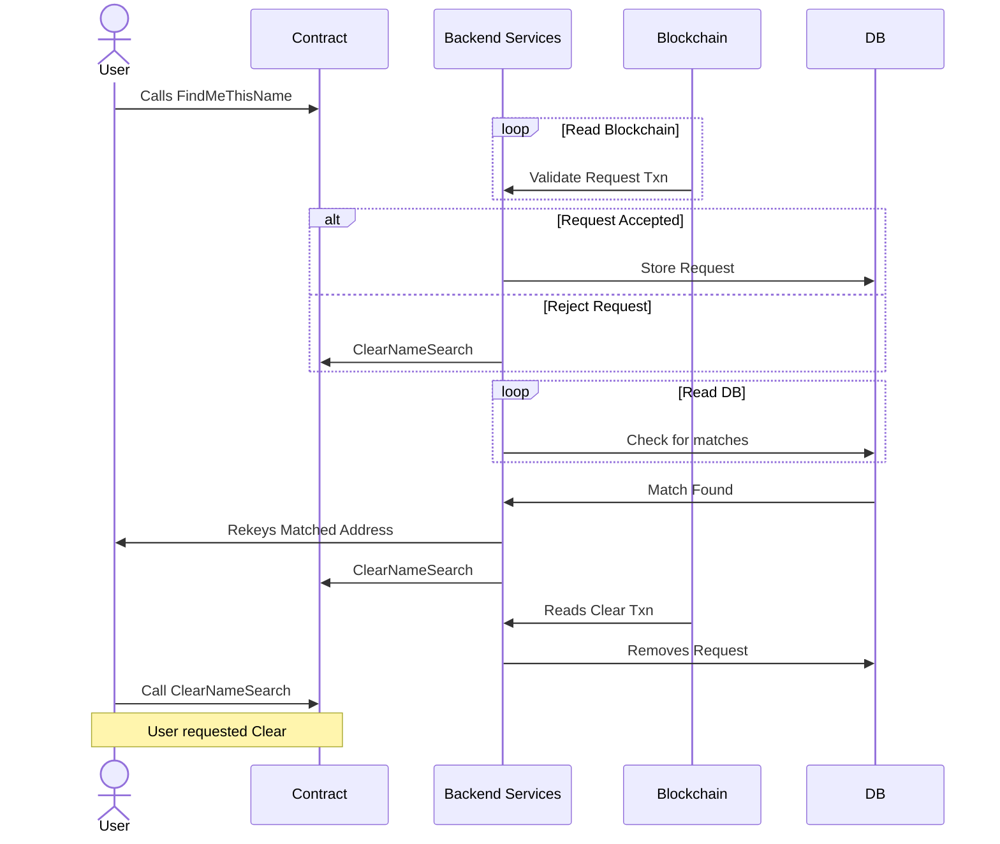

## Overview of how the Address Finder backend works.

The sub directories contain more information about the functionality of the scripts. 

```mermaid
sequenceDiagram
    actor User
    participant Contract
    participant Backend Services
    participant Blockchain
    participant DB
    User->>Contract: Calls FindMeThisName
    loop Read Blockchain
        Blockchain->>Backend Services: Validate Request Txn
    end
    alt Request Accepted
        Backend Services->>DB: Store Request
    else Reject Request
        Backend Services->>Contract: ClearNameSearch
    end
    loop Read DB
        Backend Services->>DB: Check for matches
    end
    DB->>Backend Services: Match Found
    Backend Services->>User: Rekeys Matched Address
    Backend Services->>Contract: ClearNameSearch
    Blockchain->>Backend Services: Reads Clear Txn  
    Backend Services->>DB: Removes Request 
    User->>Contract: Call ClearNameSearch
    Note over User,Contract: User requested Clear
```
